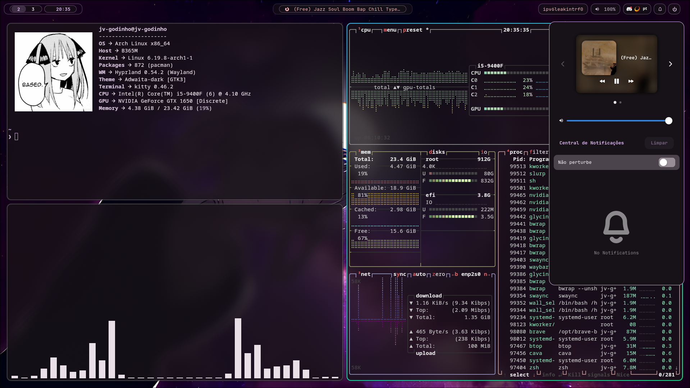
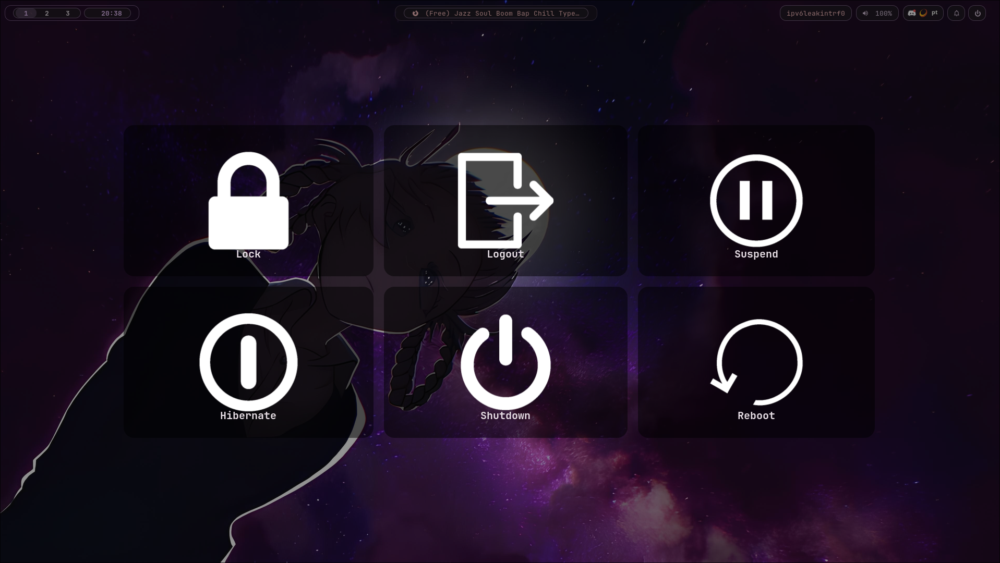

# Arch + Hyprland rice

Meu setup pessoal do Arch Linux com Hyprland, tematizado dinamicamente com base no wallpaper ativo via Matugen.

---

## Screenshots

---

## Stack

- **OS:** Arch Linux
- **WM:** Hyprland (Wayland)
- **Bar:** Waybar
- **Launcher:** Rofi
- **Terminal:** Kitty
- **Shell:** Zsh
- **Notifications:** SwayNC
- **Lock:** Hyprlock
- **Login:** SDDM
- **Colors:** Matugen (dinâmico via wallpaper)
- **Wallpaper:** swww

---

## Features

- Tema dinâmico — trocar o wallpaper atualiza todas as cores do sistema automaticamente
- Wallpaper picker com preview integrado ao Rofi
- Tela de login sincronizada com o wallpaper ativo
